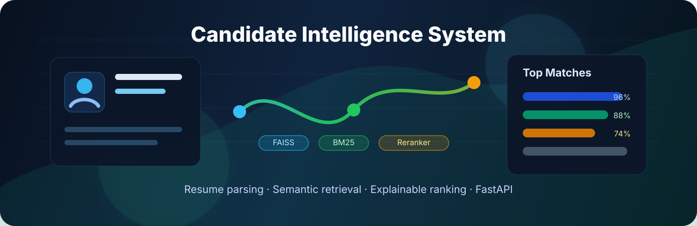
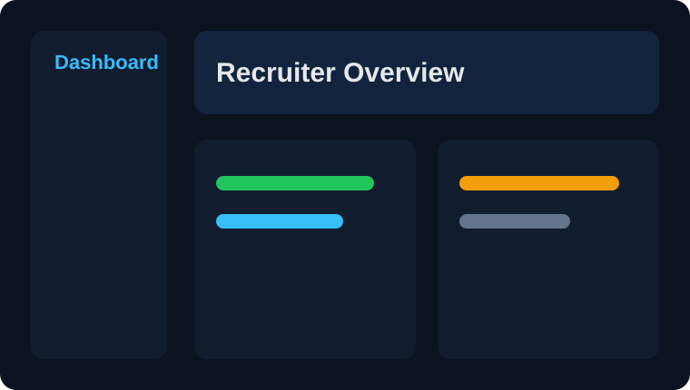
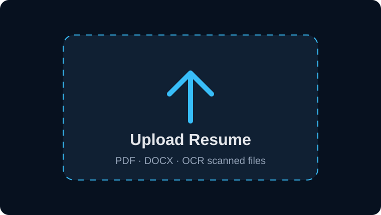
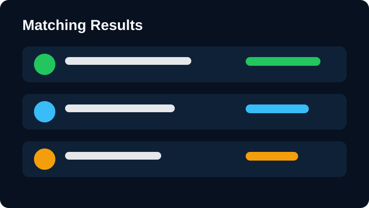
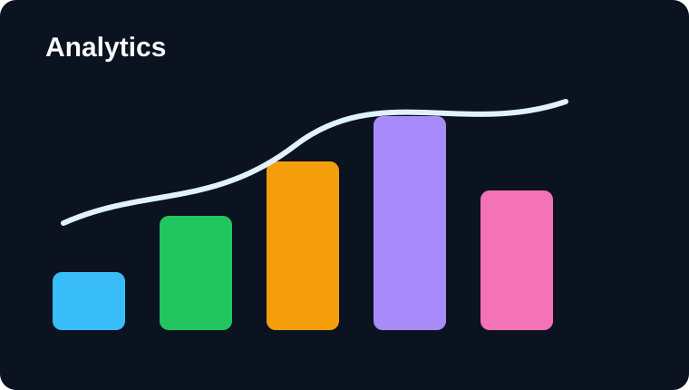
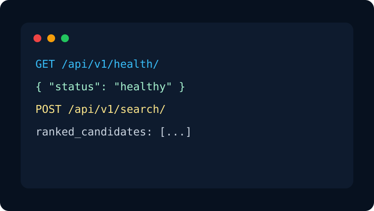
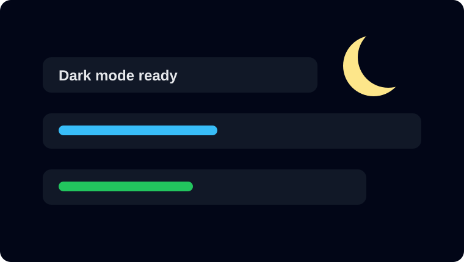

diff --git a/candidate_ai/README.md b/candidate_ai/README.md
new file mode 100644
--- /dev/null
+++ b/candidate_ai/README.md
@@ -0,0 +1,831 @@
+<div align="center">
+
+
+
+# Candidate Intelligence System
+
+### AI-powered resume intelligence, semantic matching, and explainable candidate ranking.
+
+**Parse resumes. Understand job descriptions. Retrieve, rerank, score, and explain the best matches through a production-ready FastAPI backend.**
+
+<br />
+
+[](https://git.io/typing-svg)
+
+<br />
+
+[](https://www.python.org/)
+[](https://fastapi.tiangolo.com/)
+[](https://www.docker.com/)
+[](https://www.sqlalchemy.org/)
+[](https://github.com/facebookresearch/faiss)
+[](https://www.sbert.net/)
+[](https://github.com/psf/black)
+[](https://docs.astral.sh/ruff/)
+
+[](LICENSE)
+[](https://github.com/harshkumarjha/candidate-ai/stargazers)
+[](https://github.com/harshkumarjha/candidate-ai/network/members)
+[](https://github.com/harshkumarjha/candidate-ai/issues)
+[](https://github.com/harshkumarjha/candidate-ai/pulls)
+[](https://github.com/harshkumarjha/candidate-ai/commits/main)
+[](https://opensource.org/)
+
+<br />
+
+<a href="#-quick-start">Quick Start</a>
+ ·
+<a href="#-architecture">Architecture</a>
+ ·
+<a href="#-api-documentation">API</a>
+ ·
+<a href="#-matching-pipeline">Pipeline</a>
+ ·
+<a href="#-contributing">Contributing</a>
+
+</div>
+
+---
+
+## 📌 Table of Contents
+
+- [Overview](#-overview)
+- [Feature Cards](#-feature-cards)
+- [Screenshots & Demo Assets](#-screenshots--demo-assets)
+- [Architecture](#-architecture)
+- [Matching Pipeline](#-matching-pipeline)
+- [Scoring Formula](#-scoring-formula)
+- [Folder Structure](#-folder-structure)
+- [Installation](#-installation)
+- [Quick Start](#-quick-start)
+- [Configuration](#-configuration)
+- [API Documentation](#-api-documentation)
+- [Technologies](#-technologies)
+- [Performance](#-performance)
+- [Testing](#-testing)
+- [Roadmap](#-roadmap)
+- [Contribution Snake](#-contribution-snake)
+- [Contributing](#-contributing)
+- [Security](#-security)
+- [FAQ](#-faq)
+- [Contact](#-contact)
+
+---
+
+## 🧠 Overview
+
+Candidate Intelligence System is a Python-first AI backend for modern hiring workflows. It turns raw resumes and job descriptions into structured intelligence, retrieves semantically relevant candidates, reranks them with cross-encoder models, and produces explainable scoring signals for recruiter review.
+
+> **Problem:** Traditional ATS systems over-index on keywords, miss semantic relevance, and rarely explain why a candidate was recommended.
+>
+> **Solution:** CIS combines document parsing, skill normalization, hybrid retrieval, ML reranking, feature scoring, and SHAP-style explanations into one extensible backend.
+
+### Built For
+
+| Audience | Why It Helps |
+|---|---|
+| Recruiters | Shortlist candidates with explainable ranking signals. |
+| Hiring Teams | Compare resume evidence against job requirements. |
+| Engineers | Use a modular FastAPI backend with testable pipeline stages. |
+| Researchers | Experiment with embeddings, BM25, reranking, and LTR models. |
+| Hackathon Teams | Demo a complete AI screening architecture quickly. |
+
+### Core Use Cases
+
+- Upload and parse resumes from PDF, DOCX, and OCR-backed scanned PDFs.
+- Parse job descriptions into role, seniority, required skills, preferred skills, domain, and experience requirements.
+- Run hybrid semantic plus keyword retrieval across candidate profiles.
+- Rerank top candidates with cross-encoder models.
+- Generate ranking records, score components, and natural-language explanations.
+- Serve everything behind clean FastAPI endpoints.
+
+---
+
+## ✨ Feature Cards
+
+| Feature | Description | Status |
+|---|---|---|
+| 📄 Resume Parsing | Extract text from PDF, DOCX, and scanned resumes using `pdfplumber`, PyMuPDF, `python-docx`, and Tesseract OCR. | ✅ Implemented |
+| 🧩 Section Detection | Detect experience, education, skills, projects, certifications, and profile sections with robust heuristics. | ✅ Implemented |
+| 🧠 JD Intelligence | Parse role requirements, seniority, skill groups, domains, and experience ranges. | ✅ Implemented |
+| 🔎 Hybrid Retrieval | Combine FAISS dense vector search with BM25 sparse search for balanced candidate discovery. | ✅ Implemented |
+| 🎯 Cross-Encoder Reranking | Score JD-resume pairs with sentence-transformers cross-encoder models. | ✅ Implemented |
+| 📊 LTR Ranking | Base ranking abstractions for XGBoost and LightGBM point-wise/list-wise scoring. | ✅ Implemented |
+| 🧾 Explainability | SHAP-backed feature contribution support with natural-language explanations. | ✅ Implemented |
+| 🔐 JWT Auth | Register, login, and protect endpoints with OAuth2 bearer tokens. | ✅ Implemented |
+| 🗃️ Async Database | SQLAlchemy 2.0 async ORM, repositories, Alembic migrations, SQLite dev, PostgreSQL-ready production. | ✅ Implemented |
+| 🐳 Docker | API, PostgreSQL, Redis, and Nginx compose stack. | ✅ Implemented |
+| 🧪 Tests | Unit and integration tests for parser and API behavior. | ✅ Implemented |
+| 🖥️ Recruiter UI | Dashboard, upload flow, comparison views, analytics. | 🧭 Planned |
+
+---
+
+## 🖼️ Screenshots & Demo Assets
+
+This repository is backend-first. SVG placeholders are included so the README renders cleanly while product screenshots are being created.
+
+| Dashboard | Resume Upload |
+|---|---|
+|  |  |
+
+| Matching Results | Analytics |
+|---|---|
+|  |  |
+
+| Developer Panel | Dark Mode |
+|---|---|
+|  |  |
+
+> Recommended demo GIF: `docs/assets/demo.gif` showing JD upload → resume parsing → ranked results → explanation panel.
+
+---
+
+## 🏗️ Architecture
+
+### System Architecture
+
+```mermaid
+graph TD
+    User[Recruiter / API Client] --> API[FastAPI Application]
+    API --> Auth[JWT Auth Layer]
+    API --> Jobs[Job Description Router]
+    API --> Candidates[Candidate Router]
+    API --> Search[Search Router]
+
+    Jobs --> JDParser[JD Parser]
+    JDParser --> SkillExtractor[Skill Extractor]
+    JDParser --> Seniority[Seniority Detector]
+    JDParser --> Domain[Domain Classifier]
+    JDParser --> JDEmbeddings[JD Embedder]
+
+    Candidates --> ResumeParser[Resume Parser]
+    ResumeParser --> PDF[PDF Parser]
+    ResumeParser --> DOCX[DOCX Parser]
+    ResumeParser --> OCR[OCR Parser]
+    ResumeParser --> Sections[Section Detector]
+    ResumeParser --> Entities[Experience / Education / Project Parsers]
+    ResumeParser --> ResumeEmbeddings[Resume Embedder]
+
+    Search --> Dense[FAISS Dense Retriever]
+    Search --> Sparse[BM25 Sparse Retriever]
+    Dense --> Hybrid[Hybrid Retriever]
+    Sparse --> Hybrid
+    Hybrid --> Reranker[Cross-Encoder Reranker]
+    Reranker --> Ranker[LTR Ranker]
+    Ranker --> Explain[SHAP Explainer]
+
+    API --> DB[(SQLite / PostgreSQL)]
+    API --> Redis[(Redis Cache)]
+    Dense --> VectorStore[(FAISS Index)]
+    Ranker --> FeatureStore[(Parquet Feature Store)]
+```
+
+### Request Sequence
+
+```mermaid
+sequenceDiagram
+    participant Client
+    participant API as FastAPI
+    participant Auth as JWT Auth
+    participant Parser as Parsing Pipeline
+    participant Retriever as Hybrid Retriever
+    participant Ranker as Ranking Engine
+    participant DB as Database
+
+    Client->>API: POST /auth/token
+    API->>Auth: verify credentials
+    Auth-->>Client: access_token
+
+    Client->>API: POST /jobs
+    API->>Parser: parse JD
+    Parser-->>API: structured JD + embeddings
+    API->>DB: persist job description
+
+    Client->>API: POST /search
+    API->>Retriever: dense + sparse retrieval
+    Retriever->>Ranker: top-k candidates
+    Ranker-->>API: final rankings + explanations
+    API->>DB: store ranking result
+    API-->>Client: ranked candidates
+```
+
+### Deployment Diagram
+
+```mermaid
+graph LR
+    Browser[Client / Browser] --> Nginx[Nginx Reverse Proxy]
+    Nginx --> API[FastAPI + Uvicorn]
+    API --> Postgres[(PostgreSQL)]
+    API --> Redis[(Redis)]
+    API --> Volumes[(Models / Embeddings / Uploads)]
+```
+
+### Data Flow
+
+```mermaid
+flowchart TD
+    A[Raw Resume / JD] --> B[Text Extraction]
+    B --> C[Text Cleaning]
+    C --> D[Section Detection]
+    D --> E[Entity Extraction]
+    E --> F[Skill Canonicalization]
+    F --> G[Embedding Generation]
+    G --> H[Dense + Sparse Retrieval]
+    H --> I[Cross-Encoder Reranking]
+    I --> J[Feature Scoring]
+    J --> K[Explainability]
+    K --> L[API Response]
+```
+
+---
+
+## 🔁 Matching Pipeline
+
+| Stage | What Happens | Key Modules |
+|---|---|---|
+| 1. Resume Parsing | Extract clean text from PDFs, DOCX files, and scanned documents. | `src/parser/*`, `src/resume/resume_parser.py` |
+| 2. JD Parsing | Convert raw job descriptions into structured requirements. | `src/jd/*` |
+| 3. Normalization | Clean whitespace, Unicode, dates, and skill variants. | `src/utils/*` |
+| 4. Entity Extraction | Pull experience, education, projects, skills, links, certifications. | `src/resume/*` |
+| 5. Embeddings | Generate dense vectors for resumes and JDs. | `resume_embedder.py`, `jd_embedder.py` |
+| 6. Retrieval | Retrieve candidates using FAISS and BM25. | `src/retrieval/*` |
+| 7. Reranking | Score candidate-job pairs using a cross-encoder. | `cross_encoder_reranker.py` |
+| 8. Ranking | Combine semantic, evidence, career, behavior, and feature scores. | `src/ranking/*` |
+| 9. Explanation | Generate SHAP feature contributions and recruiter-readable rationale. | `src/explainability/*` |
+
+```mermaid
+flowchart LR
+    Upload[Resume Upload] --> Parse[Parser]
+    Parse --> Normalize[Normalization]
+    Normalize --> Extract[Entity Extraction]
+    Extract --> Skills[Skill Matching]
+    Skills --> Experience[Experience Matching]
+    Experience --> Semantic[Semantic Search]
+    Semantic --> Score[Scoring Engine]
+    Score --> Recommend[Recommendation]
+    Recommend --> Response[Frontend / API Response]
+```
+
+---
+
+## 🧮 Scoring Formula
+
+CIS is designed around composable score components. The current ranking surface supports:
+
+```text
+final_score =
+  w1 * semantic_score +
+  w2 * evidence_score +
+  w3 * career_score +
+  w4 * behavior_score +
+  w5 * model_score
+```
+
+| Signal | Weight | Meaning |
+|---|---:|---|
+| Semantic Match | 0.35 | Vector similarity and cross-encoder relevance. |
+| Evidence Strength | 0.25 | Resume evidence supporting required skills. |
+| Career Fit | 0.20 | Tenure, seniority, progression, and domain alignment. |
+| Behavior / Authenticity | 0.10 | Consistency and anomaly-aware signals. |
+| LTR Model Score | 0.10 | Learned ranking model output. |
+
+```mermaid
+pie title Candidate Ranking Signal Mix
+    "Semantic Match" : 35
+    "Evidence Strength" : 25
+    "Career Fit" : 20
+    "Behavior / Authenticity" : 10
+    "LTR Model Score" : 10
+```
+
+> Tune weights with labeled validation data before production use.
+
+---
+
+## 📁 Folder Structure
+
+```text
+candidate_ai/
+├── alembic/                     # Database migration environment
+│   └── versions/                # Alembic migration revisions
+├── configs/                     # App, model, and feature configuration
+├── docker/                      # Dockerfile, compose stack, Nginx config
+├── src/
+│   ├── api/                     # FastAPI app, routers, dependencies, DB models
+│   │   ├── models/              # Pydantic request/response models
+│   │   ├── repositories/        # Async database repositories
+│   │   └── routers/             # auth, jobs, candidates, search, health
+│   ├── behavior/                # Behavior scoring extension namespace
+│   ├── career/                  # Career timeline and trajectory extension namespace
+│   ├── evidence/                # Evidence extraction/scoring extension namespace
+│   ├── explainability/          # SHAP explanations and natural-language rationale
+│   ├── features/                # Parquet-backed feature store
+│   ├── graph/                   # Skill ontology and ontology data
+│   ├── jd/                      # Job description parsing and embedding
+│   ├── parser/                  # PDF, DOCX, OCR, section parsing
+│   ├── ranking/                 # LTR ranker abstractions
+│   ├── resume/                  # Resume parsing, entity extraction, embeddings
+│   ├── retrieval/               # FAISS, BM25, hybrid search, reranking
+│   └── utils/                   # Logging, validation, dates, skills, text cleaning
+├── tests/
+│   ├── integration/             # FastAPI endpoint tests
+│   └── unit/                    # Parser and utility tests
+├── requirements.txt             # Runtime and development dependencies
+├── pyproject.toml               # Pytest configuration
+└── README.md                    # Project documentation
+```
+
+---
+
+## ⚙️ Installation
+
+### Requirements
+
+- Python 3.12 recommended
+- Tesseract OCR for scanned PDFs
+- Docker and Docker Compose for containerized deployment
+- macOS, Linux, or Windows with WSL2
+
+### macOS
+
+```bash
+brew install python@3.12 tesseract
+cd candidate_ai
+/opt/homebrew/bin/python3.12 -m venv .venv
+source .venv/bin/activate
+python -m pip install --upgrade pip setuptools wheel
+python -m pip install -r requirements.txt
+```
+
+### Linux
+
+```bash
+sudo apt-get update
+sudo apt-get install -y python3.12 python3.12-venv tesseract-ocr
+cd candidate_ai
+python3.12 -m venv .venv
+source .venv/bin/activate
+python -m pip install --upgrade pip setuptools wheel
+python -m pip install -r requirements.txt
+```
+
+### Windows
+
+```powershell
+cd candidate_ai
+py -3.12 -m venv .venv
+.\.venv\Scripts\Activate.ps1
+python -m pip install --upgrade pip setuptools wheel
+python -m pip install -r requirements.txt
+```
+
+Install Tesseract from the official Windows installer and ensure `tesseract.exe` is on `PATH`.
+
+### Docker
+
+```bash
+cd candidate_ai/docker
+docker compose up --build
+```
+
+---
+
+## 🚀 Quick Start
+
+```bash
+cd /Users/harshkumarjha/Desktop/Resume/candidate_ai
+source .venv/bin/activate
+alembic upgrade head
+uvicorn src.api.main:app --host 127.0.0.1 --port 8000
+```
+
+Open:
+
+- API Docs: `http://127.0.0.1:8000/api/docs`
+- Health: `http://127.0.0.1:8000/api/v1/health/`
+
+Smoke test:
+
+```bash
+curl -sS http://127.0.0.1:8000/api/v1/health/ | python -m json.tool
+```
+
+---
+
+## 🔧 Configuration
+
+Settings are loaded from environment variables and `.env`.
+
+| Variable | Default | Description |
+|---|---|---|
+| `DB_URL` | `sqlite+aiosqlite:///./data/candidate_ai.db` | Async database URL. |
+| `SECRET_KEY` | development placeholder | JWT signing secret. Replace in production. |
+| `ACCESS_TOKEN_EXPIRE_MINUTES` | `30` | JWT access token lifetime. |
+| `REFRESH_TOKEN_EXPIRE_DAYS` | `7` | Refresh token lifetime placeholder. |
+| `MODEL_PATH` | `./models` | Base model directory. |
+| `FAISS_INDEX_PATH` | `./models/embeddings/faiss_index.faiss` | FAISS index path. |
+| `EMBEDDING_MODEL` | `BAAI/bge-base-en-v1.5` | Sentence embedding model. |
+| `CROSS_ENCODER_MODEL` | `cross-encoder/ms-marco-MiniLM-L-6-v2` | Reranking model. |
+| `RANKER_MODEL_PATH` | `./models/ranker/xgboost_ranker_v1.json` | LTR model path. |
+| `AUTHENTICITY_MODEL_PATH` | `./models/authenticity/evidence_model_v1.pkl` | Authenticity model path. |
+| `REDIS_URL` | `redis://localhost:6379/0` | Redis connection URL. |
+| `LOG_LEVEL` | `INFO` | Application log level. |
+| `MAX_UPLOAD_SIZE_MB` | `10` | Upload limit. |
+| `FEATURE_CONFIG_PATH` | `./configs/feature_config.json` | Feature schema config. |
+| `FEATURE_VERSION` | `v1` | Active feature version. |
+| `UPLOAD_DIR` | `./data/uploads` | Upload directory. |
+
+```bash
+cp .env.example .env
+```
+
+---
+
+## 📡 API Documentation
+
+All routes are mounted under `/api/v1`.
+
+### Health
+
+| Method | Endpoint | Description | Auth |
+|---|---|---|---|
+| `GET` | `/health/` | Service health, model versions, FAISS status, DB status. | No |
+
+```bash
+curl http://127.0.0.1:8000/api/v1/health/
+```
+
+```json
+{
+  "status": "healthy",
+  "model_versions": {
+    "embedding": "BAAI/bge-base-en-v1.5",
+    "cross_encoder": "cross-encoder/ms-marco-MiniLM-L-6-v2",
+    "ranker": "./models/ranker/xgboost_ranker_v1.json"
+  },
+  "faiss_index_size": 0,
+  "uptime_seconds": 18.75,
+  "db_connection": "ok"
+}
+```
+
+### Authentication
+
+| Method | Endpoint | Description | Auth |
+|---|---|---|---|
+| `POST` | `/auth/register` | Create a recruiter/admin user. | No |
+| `POST` | `/auth/token` | Issue OAuth2 bearer token. | No |
+
+```bash
+curl -X POST http://127.0.0.1:8000/api/v1/auth/register \
+  -H "Content-Type: application/json" \
+  -d '{"username":"demo","password":"demo-password-123","role":"recruiter"}'
+```
+
+```bash
+curl -X POST http://127.0.0.1:8000/api/v1/auth/token \
+  -H "Content-Type: application/x-www-form-urlencoded" \
+  -d "username=demo&password=demo-password-123"
+```
+
+### Jobs
+
+| Method | Endpoint | Description | Auth |
+|---|---|---|---|
+| `POST` | `/jobs/` | Create and parse a job description. | Yes |
+| `GET` | `/jobs/` | List job descriptions. | Yes |
+| `GET` | `/jobs/{jd_id}` | Get job description by ID. | Yes |
+
+### Candidates
+
+| Method | Endpoint | Description | Auth |
+|---|---|---|---|
+| `POST` | `/candidates/` | Upload or create candidate profile. | Yes |
+| `GET` | `/candidates/` | List candidates. | Yes |
+| `GET` | `/candidates/{candidate_id}` | Get candidate details. | Yes |
+
+### Search & Ranking
+
+| Method | Endpoint | Description | Auth |
+|---|---|---|---|
+| `POST` | `/search/` | Retrieve and rank candidates for a JD. | Yes |
+| `GET` | `/search/rankings/{jd_id}` | Get stored rankings for a JD. | Yes |
+
+Common errors:
+
+| Status | Meaning |
+|---:|---|
+| `400` | Invalid request or duplicate resource. |
+| `401` | Missing or invalid bearer token. |
+| `403` | Disabled user or insufficient access. |
+| `404` | Resource not found. |
+| `500` | Unhandled server error. |
+
+---
+
+## 🧰 Technologies
+
+| Category | Stack |
+|---|---|
+| Language | Python 3.12 |
+| API | FastAPI, Uvicorn, Pydantic v2 |
+| Database | SQLAlchemy 2.0 async, Alembic, SQLite, PostgreSQL |
+| Auth | OAuth2 Password Flow, JWT, passlib, bcrypt |
+| NLP | spaCy, transformers, sentence-transformers |
+| Retrieval | FAISS, rank-bm25 |
+| ML | scikit-learn, XGBoost, LightGBM, Optuna |
+| Explainability | SHAP |
+| Data | pandas, NumPy, PyArrow, Parquet |
+| Parsing | pdfplumber, PyMuPDF, python-docx, pytesseract, Pillow |
+| DevOps | Docker, Docker Compose, Nginx |
+| Quality | pytest, pytest-asyncio, Black, Ruff, mypy |
+
+---
+
+## 📈 Performance
+
+Current verified local status:
+
+| Check | Result |
+|---|---|
+| Unit + integration tests | `35 passed` |
+| Dependency health | `pip check` passed |
+| Database migration | `001_initial (head)` |
+| API smoke test | `/api/v1/health/` returned healthy |
+| OCR CLI | Tesseract `5.5.2` verified |
+
+Recommended benchmark targets:
+
+| Metric | Target |
+|---|---:|
+| Health endpoint latency | `< 50 ms` |
+| JD parsing latency | `< 500 ms` |
+| Resume parsing latency | `< 3 s` for text PDFs |
+| Hybrid retrieval latency | `< 1 s` for indexed corpora |
+| Reranking latency | Depends on top-k and hardware |
+
+> Accuracy, precision, recall, and NDCG should be measured with labeled JD-resume pairs before production deployment.
+
+---
+
+## ✅ Features
+
+### Implemented
+
+- [x] FastAPI application lifecycle
+- [x] JWT authentication
+- [x] SQLAlchemy async models
+- [x] Alembic initial migration
+- [x] Repository layer
+- [x] Resume text parsing
+- [x] JD parsing
+- [x] Skill extraction and canonicalization
+- [x] Dense retrieval
+- [x] Sparse retrieval
+- [x] Hybrid search
+- [x] Cross-encoder reranking
+- [x] LTR ranker base classes
+- [x] SHAP explainer
+- [x] Feature store
+- [x] Docker assets
+- [x] Unit and integration tests
+
+### In Progress / Extension Points
+
+- [ ] Training data ingestion
+- [ ] Synthetic labeled pair generator
+- [ ] Skill graph feature expansion
+- [ ] Evidence authenticity model training
+- [ ] Model registry lifecycle
+
+### Planned
+
+- [ ] Recruiter dashboard
+- [ ] Resume optimization assistant
+- [ ] Interview success prediction
+- [ ] Multilingual resume parsing
+- [ ] Cloud deployment templates
+- [ ] Analytics and fairness reports
+- [ ] Human feedback loop for ranking improvement
+
+---
+
+## 🧪 Testing
+
+```bash
+source .venv/bin/activate
+pytest
+```
+
+Run with coverage:
+
+```bash
+pytest --cov=src --cov-report=term-missing
+```
+
+Run a specific test file:
+
+```bash
+pytest tests/unit/test_parser.py
+pytest tests/integration/test_api_endpoints.py
+```
+
+Quality checks:
+
+```bash
+black src tests
+ruff check src tests
+mypy src
+```
+
+---
+
+## 🐳 Docker Deployment
+
+```bash
+cd candidate_ai/docker
+docker compose up --build
+```
+
+| Service | Purpose |
+|---|---|
+| API | FastAPI backend |
+| PostgreSQL | Production database |
+| Redis | Caching / async extension point |
+| Nginx | Reverse proxy |
+
+---
+
+## 🗺️ Roadmap
+
+```mermaid
+timeline
+    title Candidate Intelligence Roadmap
+    Phase 1 : Project scaffolding
+            : Async database layer
+            : Alembic migrations
+    Phase 2 : Resume parsing
+            : JD parsing
+            : Skill extraction
+    Phase 3 : Dense retrieval
+            : BM25 retrieval
+            : Hybrid search
+    Phase 4 : Feature engineering
+            : Evidence graph
+            : Career intelligence
+    Phase 5 : LTR ranking
+            : SHAP explainability
+    Phase 6 : API hardening
+            : Docker deployment
+            : Observability
+    Phase 7 : Frontend dashboard
+            : Analytics
+            : Human feedback loop
+```
+
+---
+
+## 🐍 Contribution Snake
+
+This README supports GitHub contribution snake animation through GitHub Actions and GitHub Pages.
+
+```md
+<picture>
+  <source media="(prefers-color-scheme: dark)" srcset="https://raw.githubusercontent.com/harshkumarjha/candidate-ai/output/github-contribution-grid-snake-dark.svg" />
+  <source media="(prefers-color-scheme: light)" srcset="https://raw.githubusercontent.com/harshkumarjha/candidate-ai/output/github-contribution-grid-snake.svg" />
+  
+</picture>
+```
+
+Setup:
+
+1. Ensure GitHub Actions are enabled.
+2. Add `.github/workflows/snake.yml`.
+3. In repository settings, set workflow permissions to read and write.
+4. Run the workflow once manually.
+5. Confirm the `output` branch contains generated SVG files.
+
+Troubleshooting:
+
+| Issue | Fix |
+|---|---|
+| 403 permission error | Enable workflow write permissions in repository settings. |
+| Image not rendering | Confirm the `output` branch exists after the first run. |
+| Wrong username | Update `github_user_name` in the workflow. |
+
+---
+
+## 🤝 Contributing
+
+Contributions are welcome. Keep changes focused, tested, and aligned with the modular pipeline design.
+
+```bash
+git clone https://github.com/harshkumarjha/candidate-ai.git
+cd candidate-ai/candidate_ai
+python3.12 -m venv .venv
+source .venv/bin/activate
+python -m pip install -r requirements.txt
+pytest
+```
+
+Contribution flow:
+
+1. Open an issue for major changes.
+2. Create a feature branch.
+3. Add or update tests.
+4. Run formatting, linting, and tests.
+5. Open a pull request with a concise explanation.
+
+Recommended PR checklist:
+
+- [ ] Tests pass locally.
+- [ ] New behavior is documented.
+- [ ] API changes include examples.
+- [ ] Security-sensitive changes are called out.
+- [ ] No secrets, model weights, or private resumes are committed.
+
+---
+
+## 🔐 Security
+
+This project processes potentially sensitive candidate data.
+
+Production guidance:
+
+- Replace the default `SECRET_KEY`.
+- Use PostgreSQL with encrypted storage where required.
+- Do not log raw resumes, emails, phone numbers, or personal identifiers.
+- Validate upload size and file types.
+- Restrict CORS origins.
+- Run behind HTTPS.
+- Add rate limiting and audit logging before external exposure.
+
+Responsible disclosure: please open a private security advisory or contact the maintainer directly for vulnerabilities.
+
+---
+
+## ❓ FAQ
+
+<details>
+<summary><strong>Does this replace a recruiter?</strong></summary>
+
+No. It is a decision-support system. Human review is required, especially for fairness, compliance, and hiring decisions.
+
+</details>
+
+<details>
+<summary><strong>Does it download ML models?</strong></summary>
+
+The first use of sentence-transformers models may download model weights such as `BAAI/bge-base-en-v1.5` and `cross-encoder/ms-marco-MiniLM-L-6-v2`.
+
+</details>
+
+<details>
+<summary><strong>Can it parse scanned PDFs?</strong></summary>
+
+Yes, through the OCR fallback, provided Tesseract is installed and available on `PATH`.
+
+</details>
+
+<details>
+<summary><strong>Is it production ready?</strong></summary>
+
+The backend architecture, database layer, Docker assets, and tests are in place. Production deployment still requires security hardening, observability, labeled evaluation, and privacy review.
+
+</details>
+
+---
+
+## 🙏 Acknowledgements
+
+Built with excellent open-source projects:
+
+- [FastAPI](https://fastapi.tiangolo.com/)
+- [SQLAlchemy](https://www.sqlalchemy.org/)
+- [Alembic](https://alembic.sqlalchemy.org/)
+- [Sentence Transformers](https://www.sbert.net/)
+- [FAISS](https://github.com/facebookresearch/faiss)
+- [rank-bm25](https://github.com/dorianbrown/rank_bm25)
+- [SHAP](https://shap.readthedocs.io/)
+- [pdfplumber](https://github.com/jsvine/pdfplumber)
+- [PyMuPDF](https://pymupdf.readthedocs.io/)
+- [Tesseract OCR](https://github.com/tesseract-ocr/tesseract)
+
+---
+
+## 📬 Contact
+
+<div align="center">
+
+**Harsh Kumar Jha**
+
+[](https://github.com/harshkumarjha)
+[](https://www.linkedin.com/)
+[](mailto:your.email@example.com)
+[](https://example.com)
+
+<br />
+
+If this project helps you, consider starring the repository.
+
+</div>
